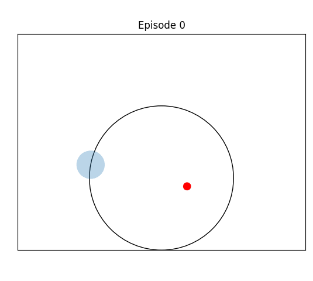
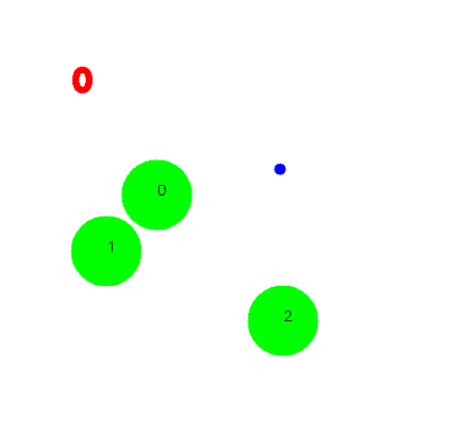
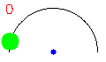

# MAMBA - Meta-RL Model-Based Algorithm
This is an official Pytorch implementation of [MAMBA: AN EFFECTIVE WORLD MODEL APPROACH
FOR META-REINFORCEMENT LEARNING](https://arxiv.org/) - Zohar Rimon, Tom Jurgenson, Orr Krupnik, Gilad Adler, Aviv Tamar, published at ICLR 2024.

## About
Check out more cool visualizations and details in our website: https://sites.google.com/view/mamba-iclr2024

MAMBA is a new model-based approach to meta-
RL, based on elements from existing state-of-the-art model-based and meta-RL
methods. We demonstrate the effectiveness of MAMBA on common meta-RL
benchmark domains, attaining greater return with better sample efficiency (up to
15×) while requiring very little hyperparameter tuning. In addition, we validate
our approach on a slate of more challenging, higher-dimensional domains, taking
a step towards real-world generalizing agents

### Results
We have a bunch of cool environments implemented in the code! 
Here are some examples of learned MAMBA policies, all of them are behaving close to the bayes-optimal policy: 

<table>
  <tr>
    <td> </td>
    <td></td>
    <td></td>
   </tr> 
   <tr>
      <td></td>
      <td></td>
      <td>
  </td>
  </tr>
</table>

For full empirical results and baseline comparisons, please refer to the paper. 
For more cool visualizations and details, check out our website: https://sites.google.com/view/mamba-iclr2024

## Installation
If you don't need MuJoCo (i.e simple environments and dm-control environments) , you can install the requirements with: 
```
pip install -r requirements.txt
```
To use MuJoCo:
1. Run ``` pip install -r requirements.txt ``` if you haven't already
2. Download MuJoCo 1.50 from [here](https://www.roboti.us/index.html), together with an activation key and place them in ```~/.mujoco/mjpro150```
3. Install mujoco-py with the following commands:
```bash
export LD_LIBRARY_PATH=$LD_LIBRARY_PATH:~/.mujoco/mjpro150/bin
export LD_LIBRARY_PATH=$LD_LIBRARY_PATH:/usr/lib/nvidia-000
conda install -c conda-forge mesalib glew glfw patchelf
pip install lockfile==0.12.2 cffi==1.15.1 Cython==0.29.36 mujoco-py==1.50.1.68
```


## Usage

### Training
Run the code, for example, with: 
```bash
python3 dreamer.py  --configs=dmc_proprio_goal  --max_episode_length=300  --num_goals=2 --num_meta_episodes=3 --steps=20000000 --task=dmc_reacher_goal --train_ratio=0.03
```
This will run reacher-4 environment from the paper with 3 episodes in every meta-episode, each of 300 steps. It will run for 20M total env steps with a train ratio of 0.03. The code will log to wandb.
You can find all of the parameters in the config.yaml file. 

### Policy Inference and VIsualization

We provide an example of how to run the policy inference and visualize the results in `policy_inference.py`.
Currently the code only supports the panda_reach environment, but it can be easily extended to other environments.
To visualize an experiment, just change the path in the policy_inference to the wandb experiment dir.

<p align="center">
  
</p>

### Adding a New Environment
To add a new environment:
1. Add the env code to the `envs` folder
2. Add the env to the make_env function in `dreamer.py` together with any needed wrappers (you can use the `envs/wrappers.py` as reference and the other envs as examples)
3. Add a new config to the `config.yaml` file


## Acknowledgments
This code is based on the following implementations:
- [Dreamer-v3 Pytorch implementation](https://github.com/NM512/dreamerv3-torch)
- [VariBAD Pytorch implementation](https://github.com/lmzintgraf/varibad)
- [HyperX Pytorch implementation](https://github.com/lmzintgraf/hyperx)

## Citation
If you find this code useful, please cite our paper:
COMING SOON

